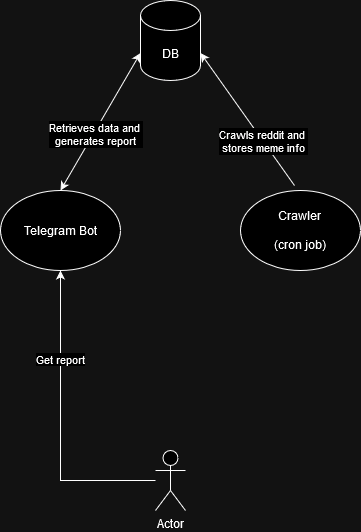

# Meme crawler

## Setup

### Prerequisites

- Docker
- Import secrets folder to root folder (api keys/secret and bot token)

### Build crawler image and run services 

`docker compose up -d --build`

### Stop and remove all services and volumes

`docker compose down -v`

## Overview

### Tables 

*top_memes*
- post_id
- author_id
- created_time
- title 
- url
- PRIMARY KEY (post_id)

*memes_snapshot*
- post_id 
- snapshot_time
- score
- num_comments
- score 
- PRIMARY KEY (post_id, snapshot_time)

### Crawler service:
1. Every hour, query top 20 posts from memes subreddit
2. Store new memes into *top_memes*
3. Query *top_memes* to get memes created in past 24hrs
4. For each meme, query reddit for its current status
5. Store snapshot in *memes_snapshot* table

### Bot service:
1. Query *top_memes* table for memes in past 24hrs
2. Store the unique memes in a set
3. Query *memes_snapshot* table for top 20 memes 
5. For each top meme, extract snapshot for past 24 hours
6. Create a line graph for scores of each top meme
7. Create table for top 20 memes in desending order
8. Return findings to user

## Visualisations

- Line graph to track performance of each top meme (steep line suggests potential for high performance)
- Top 20 table of memes

##  Improvements

1. Create word cloud of top 20 memes to see if there is a trending themes 
2. Summarise the comments for each top 20 post 